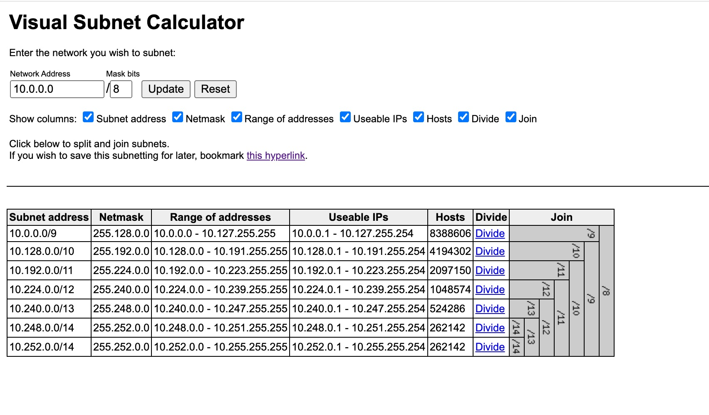

# Visual Subnet Calculator




# Run with docker

```
cd <project folder>
docker build . -t subnets
docker run -d -p 5001:80 --name subnets subnets

# Go to the URL below on your browser 
http://localhost:5001/subnets.html
```


..

Credit: Based on Davidc's subnets project. 