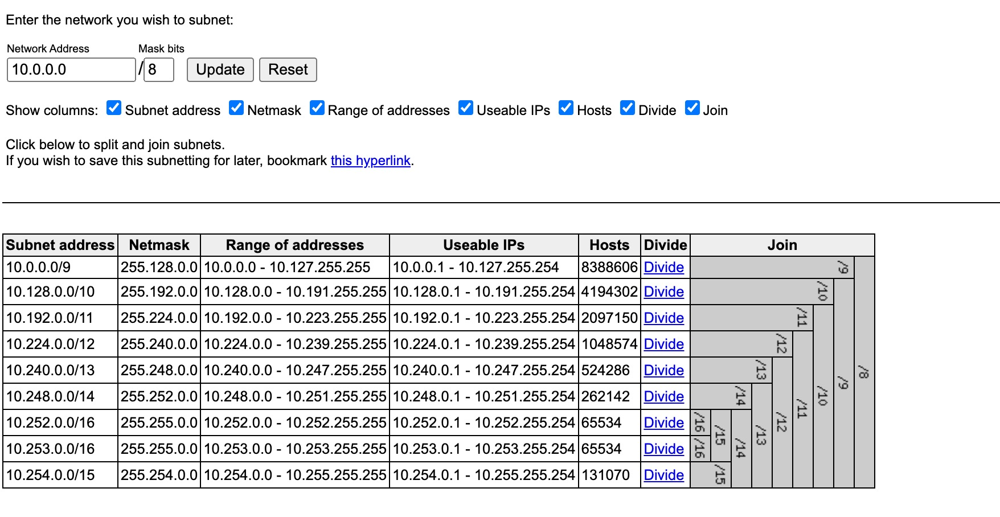

# Visual Subnet Calculator




## Run locally (no Docker)

Because the app is now completely static (HTML + JS + images), you have multiple simple options:

### 1. Open the file directly
Just open `subnets.html` in your browser (double‑click or drag into a tab).

### 2. Serve via a tiny Python web server
```
cd Applications/SubnetVisualizer
python3 -m http.server 8000
# or specify a different port: python3 -m http.server 5173
# Then in your browser:
http://localhost:8000/subnets.html
```
(Serving avoids any stricter browser `file://` policies.)

### 3. Serve with Node (optional)
```
cd Applications/SubnetVisualizer
npx serve .   # or: npx http-server .
```

---
## Run with Docker

A lightweight image (nginx:alpine) now serves the static content.
```
cd Applications/SubnetVisualizer
# Build
docker build -t subnets .
# Run (map container port 80 to host 5001)
docker run -d --name subnets -p 5001:80 subnets

# Open in browser (root or explicit file both work now):
http://localhost:5001/
# or
http://localhost:5001/subnets.html
```
To rebuild after changes:
```
docker build --no-cache -t subnets . && docker restart subnets
```

### Docker image notes
- Base image changed from deprecated `php:5.6-apache` to `nginx:alpine` (smaller, maintained, faster start).
- `index.php` is no longer required (root now serves `subnets.html` as `index.html`).
- A simple `HEALTHCHECK` was added.
- All content is static; no server‑side execution required.

If you no longer need the legacy PHP bits (`index.php`, `gennum.php`), you may delete them. The pre-generated glyph images in `img/` make `gennum.php` unnecessary.

---
## Project Overview
Interactive visual subnetting tool that lets you iteratively divide / join subnets and bookmark the resulting layout via a query string.

---
Credit: Based on Davidc's subnets project.